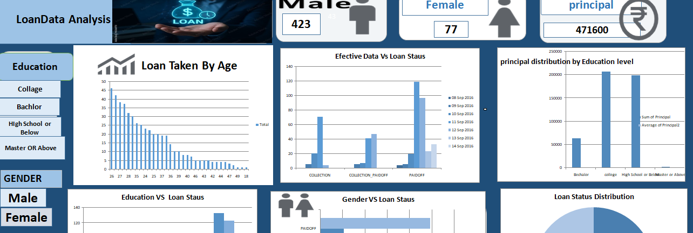
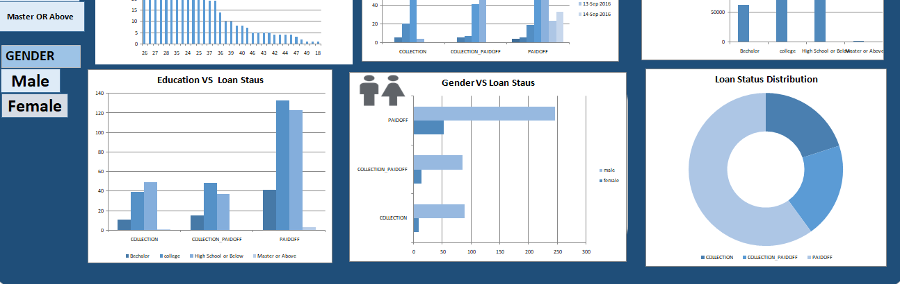

# Loan Data Analysis Dashboard 📊

## 📌 Project Overview

The **Loan Data Analysis Dashboard** is an Excel-based data analysis project designed to analyze loan data and present important insights through an interactive and visual dashboard.

The dashboard helps understand loan distribution based on factors such as **age, education, gender, loan status, and principal amount**.

## 🎯 Objectives

- Analyze loan data and identify important patterns.
- Understand loan distribution across different age groups.
- Compare loan status across education levels.
- Analyze loan status based on gender.
- Analyze principal distribution by education level.
- Present key insights using charts and visualizations.

## 🛠️ Tools & Technologies

- Microsoft Excel
- Data Cleaning
- Data Analysis
- Pivot Tables
- Charts & Visualizations
- Dashboard Design

## 📊 Dashboard Analysis

The dashboard includes:

- **Loan Taken By Age**
- **Effective Date vs Loan Status**
- **Principal Distribution by Education Level**
- **Education vs Loan Status**
- **Gender vs Loan Status**
- **Loan Status Distribution**
- Key summary figures such as gender-wise loan information and principal amount.

## 📈 Key Insights

The dashboard provides a visual understanding of:

- Loan distribution across different age groups.
- Differences in loan status among education levels.
- Gender-wise loan status patterns.
- Distribution of principal amounts across education categories.
- Overall loan status distribution.

## 📁 Project Files

- `Loan Payments dataset (1).xlsx` — Dataset used for analysis.
- `dashboard-1.png` — Dashboard screenshot.
- `dashboard-2.png` — Dashboard screenshot.

## 🖼️ Dashboard Preview

### Dashboard 1

### Dashboard 2

## 💡 Skills Demonstrated

- Data Analysis
- Data Cleaning
- Excel Dashboard Creation
- Data Visualization
- Analytical Thinking
- Business Insights

## 👩‍💻 Author

**Chetna**

BCA Student | Aspiring Data Analyst
